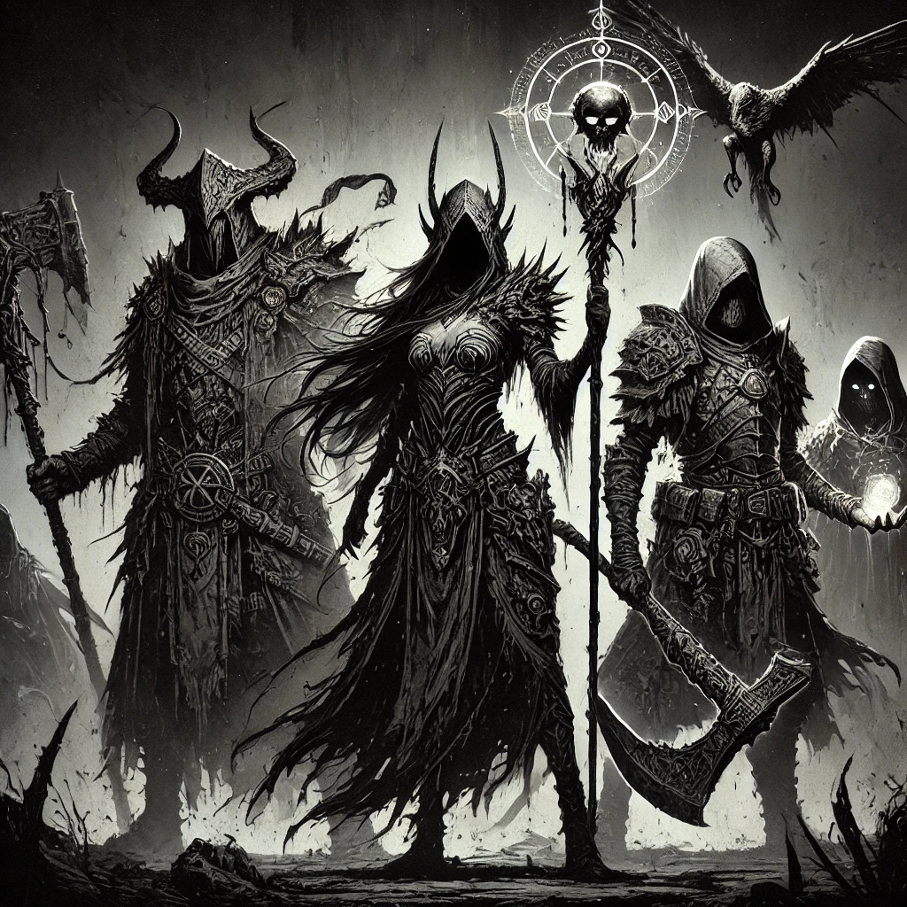
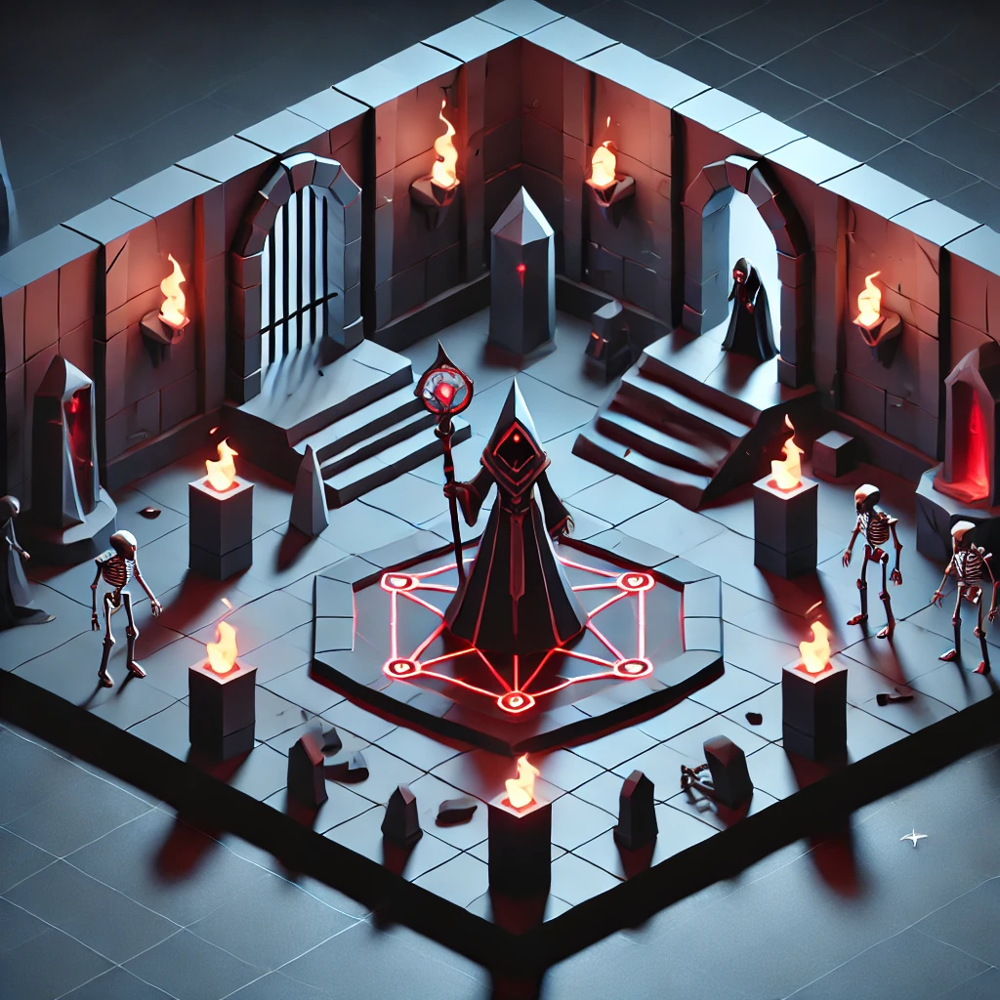

# MorningStar Design Document 
**Concept Statement:** A cooperative RPG game about building a community defending against evil entities through missions.

**Genre:** Multiplayer RPG

## Product Design

### Player Experience
The player is a dark hero in a grim fantasy world. Players should feel as though they have a tangable effect on the game world.

### Style
A mission should feel like a heavy metal concert.

### Game World
You're fighting back against the end of days.

### Monetization
Two options: Free to play with in game purchases for extra content OR 1 time payment will all options forever

### Platform, Tech, Scope
- Platform: PC, Linux
- Godot
- Low Poly 3D
- Hybrid Networking (Client-Server + P2P)
- 1 year production

## Game Design
### Minimum Viable Product
- Central Hub (Client-Server)
  - Client -> Gateway, Server
  - Gateway -> Client, Authenticator
  - Server -> Client, Authenticator
- Mission (p2p)
  - Journal
- Movement; square grid based (combat), free (out of combat)
  - A* pathfinding/navigation
  - Pathing Highlighting
- Inputs
  - **M1:** Select
  - **M2 (hold) + Mouse:** Rotate camera around character
  - **Roll Up/Down:** Zoom
  - **Tab/C, I, J, O:** Character menu
  - **Esc:** Game menu
  - **Arrows/WASD:** Pan camera
  - **Enter:** Start chat/ Send chat
- Combat
  - Melee Attacks
  - Magic (Hearts/Diamonds/Spades/Clubs)
  - Sync'd Turns
- Chat
  - Social
  - Event log
  - Combat log
- Items
  - Held items (Weapon, Shield, Trinket)
  - Armor
- Menus
  - Character menu (Stats, Inventory, Journal, Social)
  - Game menu (options, log out)
- Enemies
  - **Behaviour:** GOAP / Director
- NPC
  - **Dialogue:** Natural Language Processing AI
  - **Behaviour:** Natural behaviour (Ideas, flaws, etc)
- Character Creation
  - **Statistics:** Attack, Magic, Defense, Health
  - **Classes:** 
    - King(Melee Focus)
    - Queen(Ranged Focus)
    - Jack(Hybrid)
  - **Aspects:**
    - Hearts (Support) - heals/buffs/debuffs
    - Diamonds (Tank) - soaks up damage
    - Spades (Controller) - affects environment
    - Clubs (Striker) - damages
  - **Naming:** Basic naming rules

## Concept Art

## 3D Scene Concept

## Music Inspiration
- Cradle of Filth - How Many Tears To Nurture A Rose?
- Arch Enemy - Nemesis
- Spiritbox - Circle With Me
- Mastodon - Blood and Thunder
- Deftones - Back To School (Mini Maggit)
- Korn - Twisted Transistor
- Type O Negative - I Don't Wanna Be Me
- Bring Me The Horizon - Kingslayer